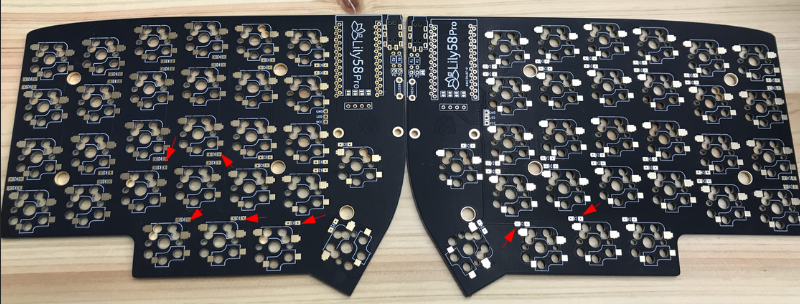
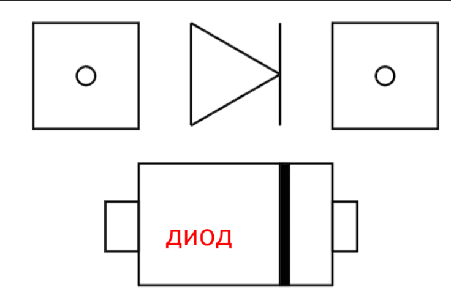
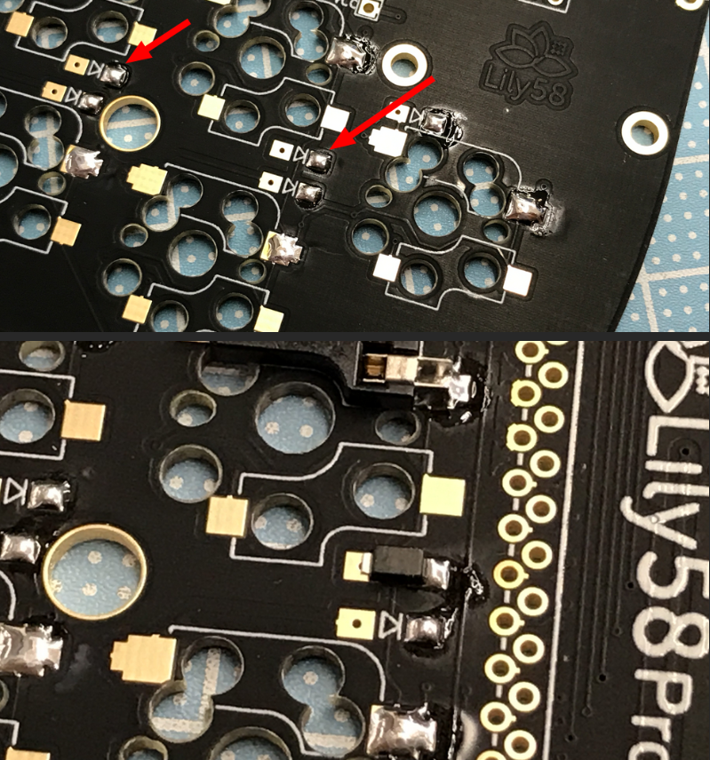
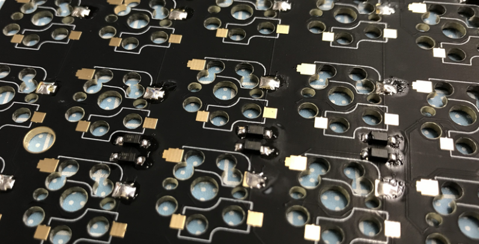
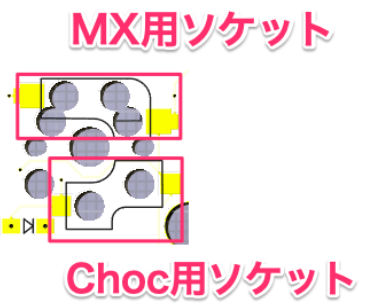
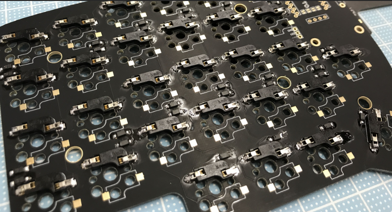
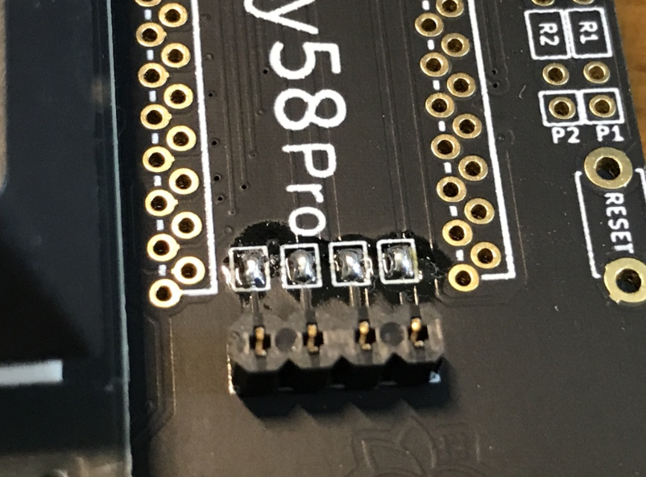
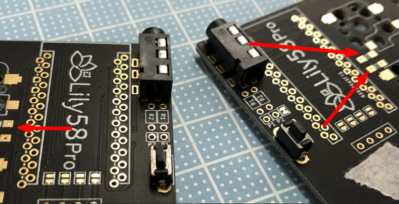
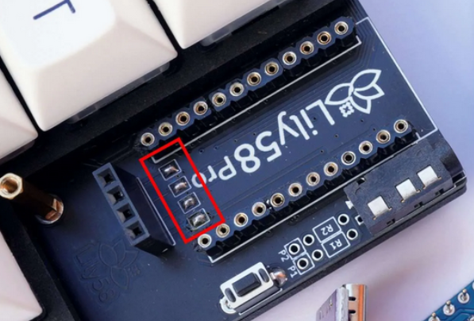
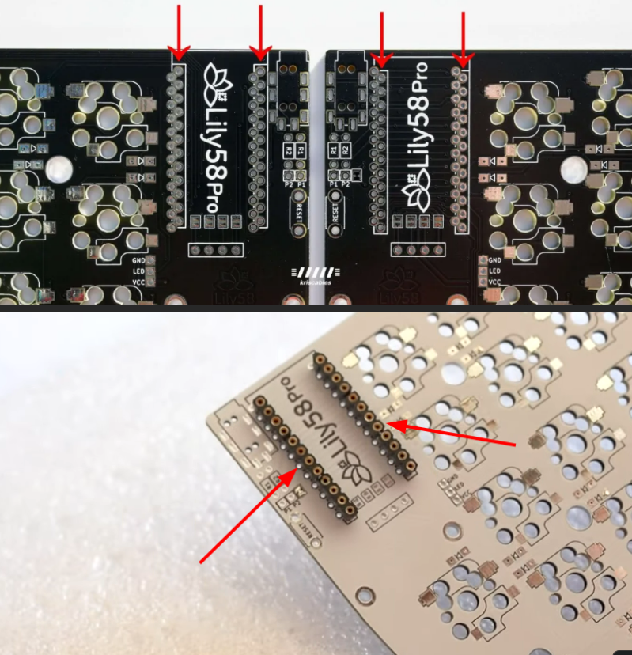

### 0. Рекомендации
1. Температура паяльника должна быть не выше 240 градусов по Цельсию (464 по Фаренгейту). Найдите припой с низкой температурой плавления (Советую Kaina) и паяльник с регулировкой температуры. Это позволит не повредить компоненты и увеличить срок службы.
2. Не подсоединяйте и не отсоединяйте кабель TRRS, когда одна сторона разделенной клавиатуры находится под напряжением. Это может привести к короткому замыканию и поломке микроконтроллера. Всегда сначала отсоединяйте USB-кабель.
3. USB порты на микроконтроллере очень легко сломать, поэтому заранее позаботьтесь о возможном подключении магнитного кабеля.
4. Прежде чем вставлять переключатели (свитчи) в hotswap, убедитесь, что его ножки не согнуты, если это так, тогда выровняйте их. В ином случае вы можете поломать свитч. Переключатель должен вставляться практически без усилий, если это не так, тогда не нужно продолжать давить, так как вы можете поломать свитч либо саму плату.
5. Сделайте сначала одну половинку клавиатуры, чтобы если вдруг накосячите, то не пришлось переделывать сразу 2 экземпляра.
6. Сварите пельмени перед процессом сборки.

### 1. Прикрепите диоды
Найдите места под диоды на плате, изначально поставьте половинки таким образом, чтобы они разделялись на левую и правую части, постарайтесь не перепутать и не спаять сразу 2 левые или 2 правые части, саму плату можно паять с любой стороны, поэтому переверните её таким образом, чтобы у вас получилось 2 половинки. Обратите внимание, на местах с диодами также есть полярность, которую необходимо соблюдать, в ином случае клавиши не будут реагировать.

Посмотрите внимательно на полярность, припаивать необходимо следующим образом:

Для начала добавьте немного припоя на каждую площадку, потом с помощью пинцета аккуратно поставьте диод на свое место. Удерживая диод пинцетом в нужном месте, расплавьте уже имеющийся припой и прикрепите к диоду. Далее также плавим другую сторону диода, чтобы он прочно находился на площадке.

P.S. Вы можете использовать мультиметр на обратной стороне платы, чтобы убедиться в надежности соединений припоя и правильной ориентации диодов.

### 2. Прикрепите Hotswap

Припаяйте все hotswap на каждой половинке, обратите внимание что есть MX hotswap и choc hotswap, на плате есть место под любые из них. В данном руководстве мы паяем именно MX, поэтому выбираем разъем, который больше.

Поместите разъем горячей замены Kailh в отверстия на печатной плате. Убедитесь, что розетки ориентированы так, чтобы они не закрывали центральное отверстие корпуса переключателя. Пример пайки есть в этом [видео](https://imgur.com/ThIzfro).

После чего убедитесь, что гнезда не шатаются и хорошо зафиксированы.

### 3. Прикрепите кнопки сброса и TRRS гнезда

Гнездо TRRS и переключатель сброса установлены на лицевой стороне (противоположной стороне диодов). Соедините детали и временно закрепите их малярным скотчем. Переверните плату и припаяйте контакты, убедившись, что гнездо TRRS и переключатель сброса плотно прилегают к плате. Убедитесь что они находятся с обратной стороны от диодов, иначе придется все перепаивать.

Диодов тут нет, они с обратной стороны.

### 4. Паяем переносной микроконтроллер

Для начала соедините перемычки как показано ниже:

Потом вставьте Female сокеты в разъемы и припаяйте их:

На следующем этапе, поместите контроллер ардуино на сокеты, чтобы ардуино была расположена компонентами к плате. Далее используя пины от SMD компонентов, сделайте ножки переносного контроллера. После того, как вы припаяете их, откусите ножки бокорезами, чтобы получить готовый компонент.

### 5. Прошивка контроллеров и тесты
Используйте [следующую статью](), чтобы выполнить прошивку клавиатуры.
